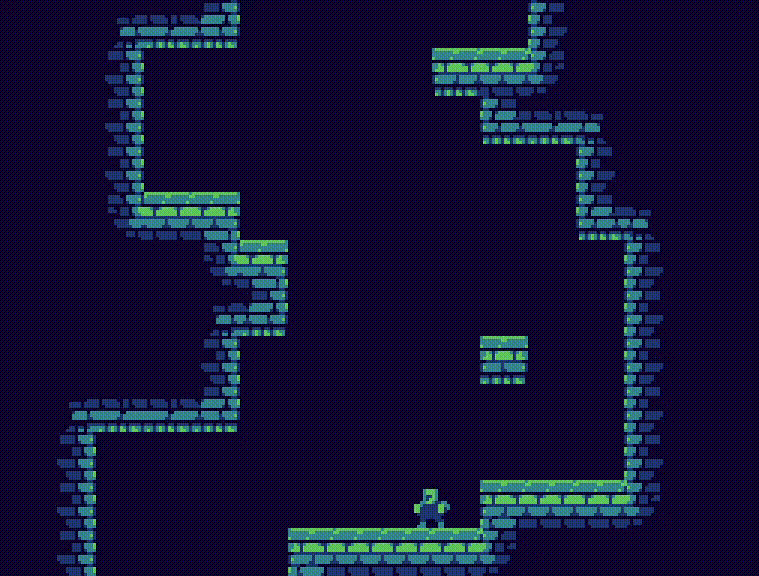

# Jump Prince
[Jump King](https://store.steampowered.com/app/1061090/Jump_King/) Clone, written in C/C++ and Raylib, for learning purposes.

This isn't a full-fledged game, but it's finished.

The source code is as simple as possible, it should be pretty easy to follow.
There are many comments to explain (briefly) what's going on.
It could be a pretty good learning resource for people getting into raylib or C/C++ game development in general.

### Features
- Tilemap VS Box collision resolution (position based, clips velocity)
- Player movement
  - jumping, charging jumps, walking
- Simple tile-based levels
  - Levels are defined using strings
- Rendering a basic tileset
